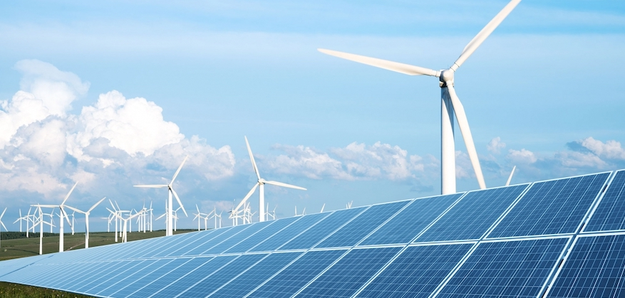

#  Transition to Renewable Electricity Resources Around the World: Are Countries Around the World Moving Towards Resources for Renewable Electricity?

This day in age, we are more dependent on electricity than ever before, and that doesn't seem to be changing any time soon. It is well known that the world population is growing, and with that energy demands are increasing. However, with the depletion of nonrenewable resources and climate change, how much of a priority is the transition to renewable resources for electricity for countries around the world? I was curious to see if there are any specific trends in regions around the world, and if the more developed countries are making this issue a priority and preparing for the future. I also explored if there are specific trends in certain areas of the world in terms of their proportions of renewable to total electricity generation.

# Data + Cleaning

I used three datasets for this study, each of which needed to be cleaned. The Energy Information Administration (EIA) has released a dataset of the types and quantity of electricity generation of countries around the world from years 1980 to 2017, which was the main resource I used for this study. An issue I came across was indented strings as row entries in the energy dataset used to represent different data based on the indentation, which  and many missing values. Missing data values were assumed to be zero. Also, many countries since 1980 have changed names, dissolved into other countries, and were slightly different between datasets, making it difficult to link data from one to the other. This was definitely the most time consuming aspect of this project, but my code can now analyze and make plots and histograms for mostly any list of countries that are inputted. 

The proportions of renewable electricity generation were generated by taking the renewable amount row of every country (which is the total of all types of renewable sources below it) and diving it by the difference of the total generation row and the hydroelectric pumped storage row.

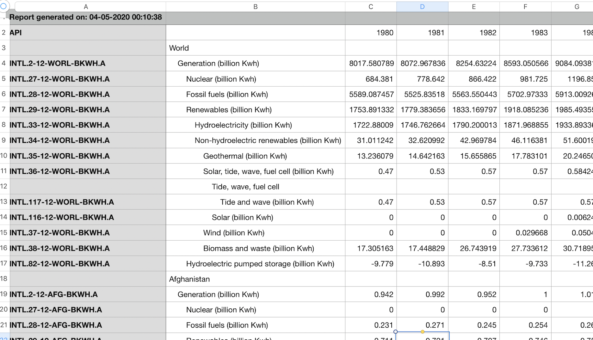

 I also used the United Nations Human Development Index to take a sample of the most highly developed countries in the world for my analysis. My primary goal of this study was to determine if the countries that have the resources to do so are transitioning to renewable resources for electricity, and I believe that the development index is a decent indicator. This dataset, for some reason contained empty columns in every other column, which were easily dropped. The only struggle with this dataset is the names of some countries are spelled slightly different in this dataset than the other dataset, making linking them for analysis tedious. My code outputs a message when a country isn't found, so I can rename them in the dataset to be consistent with the energy dataset. 

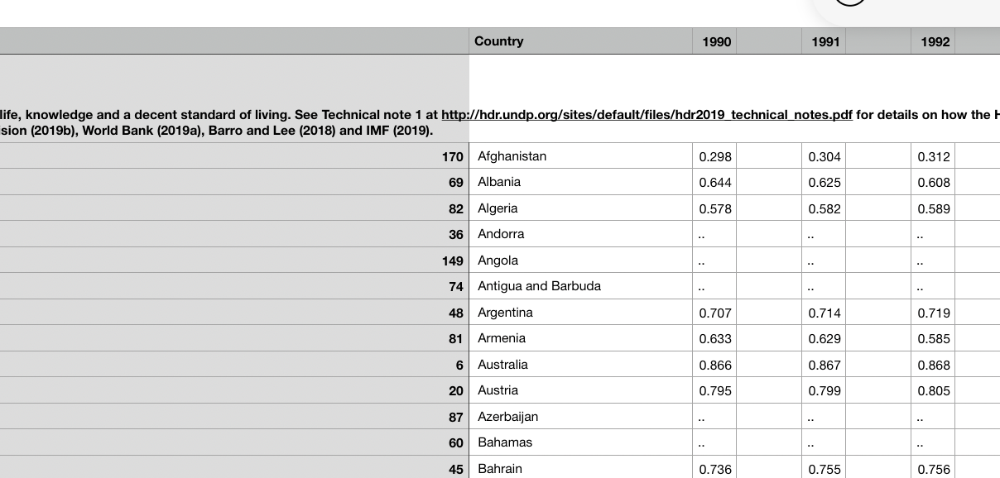

I also used the World Population dataset from the World bank to analyze if the most populated countries in the world were transitioning their energy. This data was mostly clean and didn't present many issues other than some country name inconsistencies.

# Question and Hypothesis
Based on the aggregated proportion of renewable electricity proprtion of all countries shown below, it does seem like there is a general increase in renewable electricity being produced, especially in recent years. However, does this trend hold true for countries around the world?

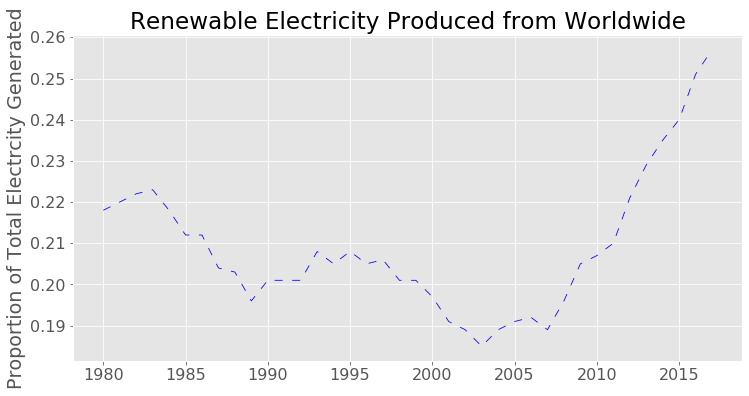

Are the most developed countries in the world transitioning to renewable resources for electricity?

My null hypothesis is that there is no difference in the proportion of electricity produced from renewable resources to total generation in 2017 of developed countries was the same or less than it was in 1980. My alternative hypothesis is that the proportion is greater in 2017. I used a significance level of 5%. Since 12 tests were run on this data, a Bonferroni Correction can be made to divide this significance level by 11, resulting in a corrected level of 0.42%. This significance level is extremely conservative and make it nearly impossible to reject the null hypothesis. Since the consequences of a type 1 error (incorrectly rejecting the null hypothesis) are not dire, a significance level of 5% may be a better choice.

I also ran a hypothesis test for regions of the world to determine if there was enough statistical significance to suggest that the proportion was higher in 2017 than 1980 for countries of higher populations, North America, Central/South America, Europe, Eurasia, Middle East, Asia/Oceania, and Africa.

# Exploratory Data Analysis

For the subsets of countries that were explored, only the top ten countries for each attribute were shown in plots for subsets that contained more than ten countries. However, the hypothesis tests took into account all countries in each particular group.

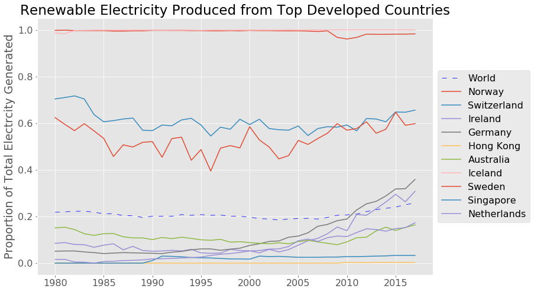

 The main goal of this project was to investigate the top developed countries. The top ten developed countries and their proportions are plotted above. There is a very wide spread but some increases. Since there is some variance in the data, I took the data from 1980 to 1983 and averaged it, using this as the before value, and averaged the data from 2014 to 2017 as the after value of each country. I then used these values for the top 35 most developed countries in the world in my hypothesis test.

 The data returned a p-value of 0.344, much too high to reject the null hypothesis for any reasonable significance value. Therefore there is insufficient evidence to suggest that the Top Developed Countries are generating a greater proportion of electricity in 2017 than in 1980.

 I performed a slightly hypothesis test on this data as well. I counted whether each country in the dataset improved their proportion by at least 15% in the time period. Then, I used this in a binomial test, with a null hypothesis that equal or less than 50% of developed countries have improved their renewable proportion by at least 15%, and an alternative hypothesis that more than 50% (the majority) of countries are making the change. I obtained a p-value of .059, which is still too high, so I failed to reject the null hypothesis in this case as well.

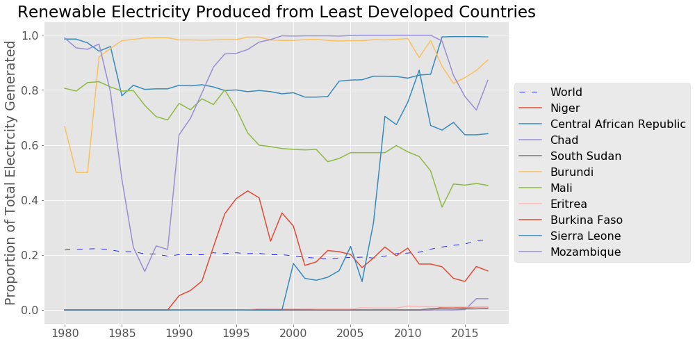

 After my finds from the most developed countries in the world, I was curious to see what I would find when testing a subset of the 35 least developed countries in the world. I found that there is a wide spread here as well, but there are many countries with a very small proportion. The hypothesis test on this data yielded a value of 0.509, much too high to reject the null hypothesis.

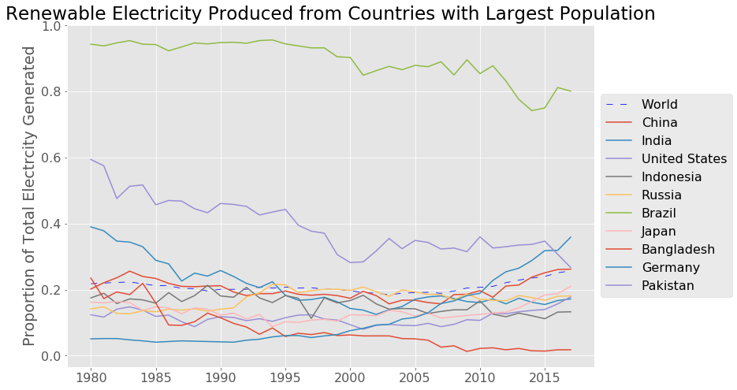

 Looking at countries with the highest population in the world, there does not appear to be much improvement over the years as well. Running a hypothesis test with the aggregated data of this subset returned a P-value of 0.53, which makes sense with the data shown.

 For the following regional plots, only the top ten are included (ordered based on 2017 proportions, high to low). 

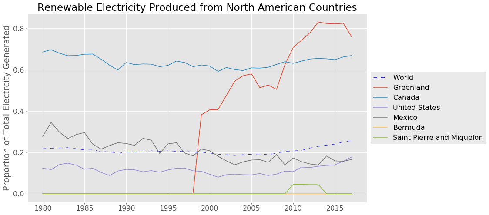

 In the North American subset of countries, again, not much of a difference between the years with one exception. Since this subset is made up of a smaller set of countries, a normal distribution using the aggregated subgroup may not be best approximation, but using it anyway yields a P-value = 0.33.

I also evaluated this using a binomial test for each individual country with an improvement threshold of 15%, which resulted in a P-value of 0.8125. This is also way too high to reject the null hypothesis.

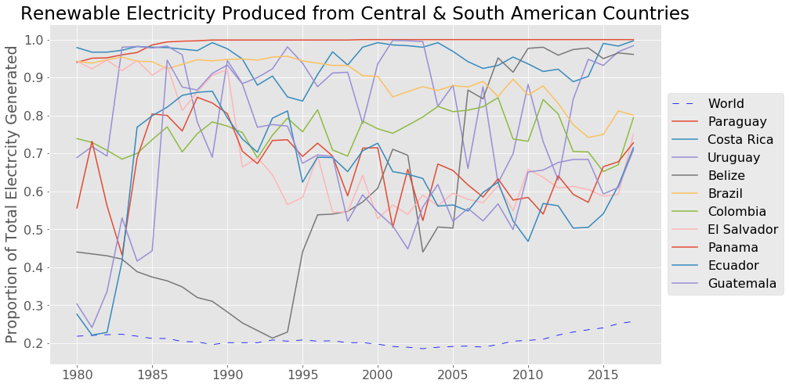

It does appear that the top South and Central American countries have high proportions, but there is a lot of fluctuations and few drastic changes in each specfic country.
P-value = 0.495

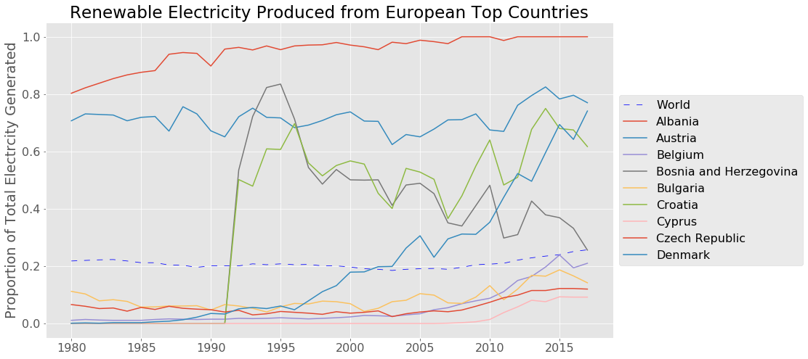

The European countries seem to show an upwards trend. The P value is smaller than any of the groups, but is still too high to reject the null hypothesis.
P-value = 0.25

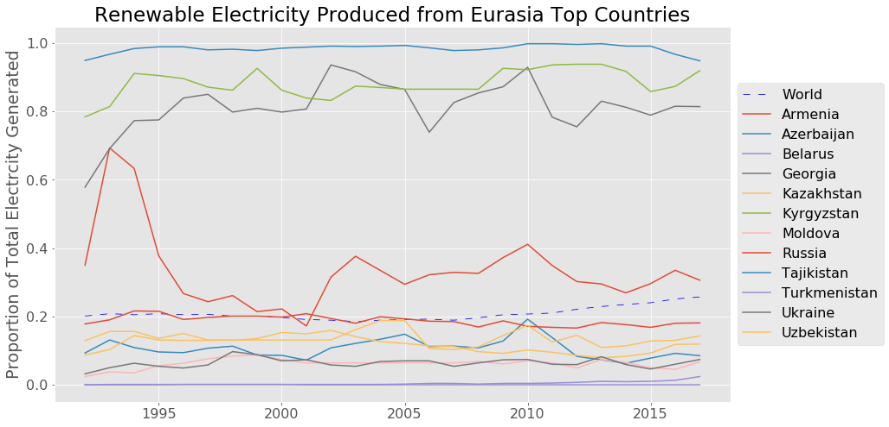

This dataset presented a challenge - the Eurasian countries were formed from Former USSR in 1992, so I used that as the minimum year instead of 1980. When using 1980 I achieved a very low P value that was more than sufficient to reject the null hypothesis, but I believe the data was flawed. The separation into several smaller countries gave a sudden rise in the proportions of said countries and a very large improvement was calculated.
P - value (from 1992 onward) : 0.485

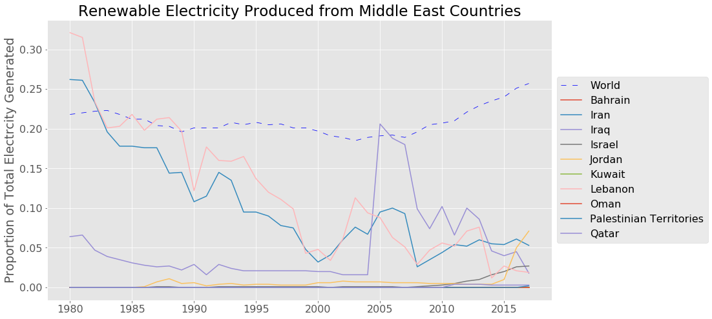

The Middle East shows a strong negative trend, and that less renewable resources are being used for electricity. Since the middle east is home to many of the world's oil reserves, my assumption is they are using a greater proportion of that as opposed to seeking renewable resources. The high P-value is consistent with this assumption.

P - value = 0.65

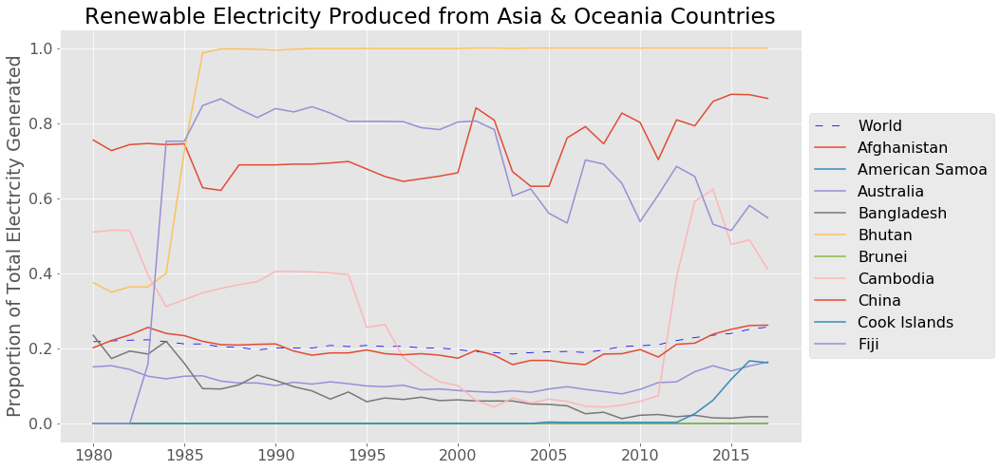

Looking at Asia/Oceania countries, again, there seems to be a great deal of fluctuation as well. 

P - value: 0.461

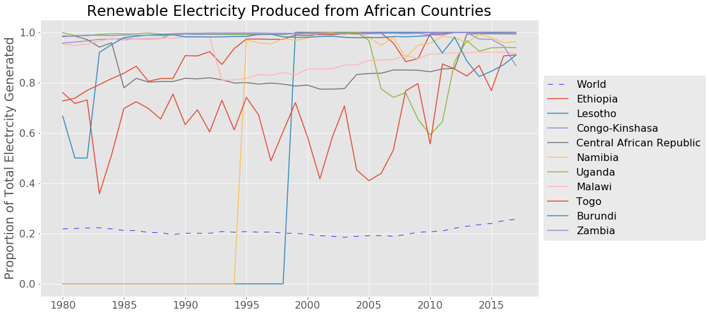

In Africa, the top 10 countries show a lot of fluctuation, but no clear upwards or downwards trend.

P = 0.541

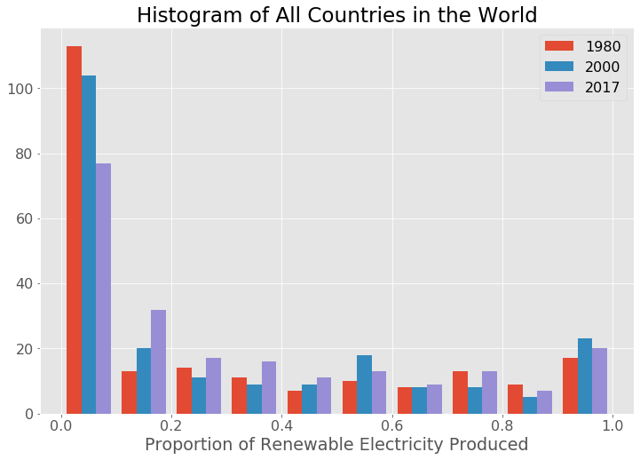

A histogram of the countries of the world shows not much improvement over the years, as well. It does appear that, at the lower end, the number of countries that produce 0% of their electricity with renewable resources seems to dropping. This could be due to the fact that more data is available in recent years.

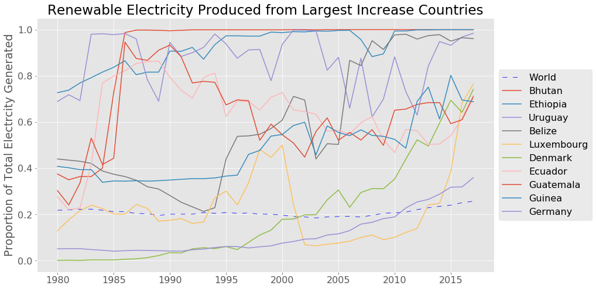 

Since I was unable to reject my null hypothesis in any of these subsets of countries, I explored just how much of an improvement we would need to see in order to reject the null hypothesis. To do this, I created a subset of the countries with the greatest increase in proportion over the time period. In order to get a p-value of less than 0.05, I had to pull a subset of countries that observed at least a 27% increase in proportion - only 11* countries in the world have had this much of an improvement!

*Countries that began with 0 or no data were ommitted.

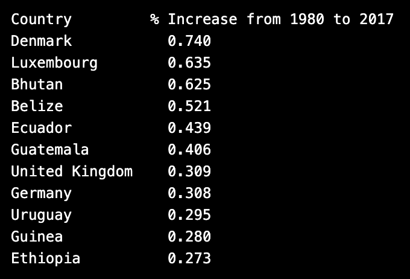

I plotted the countries with the top 20 highest proportions in 2017 on this map. Although there are a couple that are clustered in one section, there is a very large spread all around the world. Some of the countries in the top 10 are developed, some are developing, and there are countries from numerous different continents represented here.

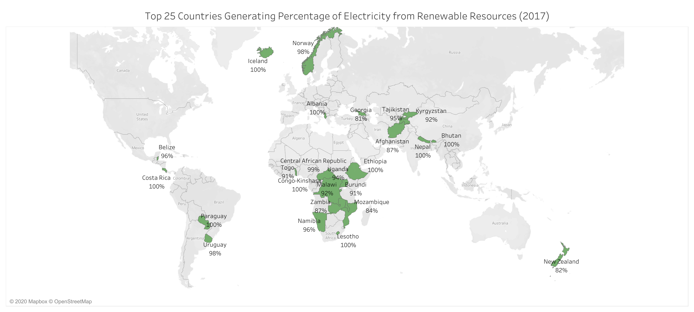

Shown below is a link to a Tableau visualization showing how the countries of the world have changed in the percentage of electricity generated from renewable resources from 1980 to 2017.

[Percentage of Renewable Electricity From 1980 to 2017](https://public.tableau.com/views/RenewableElectricityGenerationOvertheYears/YearlyAnimationDashboard?:language=en&:display_count=y&:origin=viz_share_link)

# Conclusion

Unfortunately, it looks like there is not sufficient evidence to support the claim that countries around the world are producing a greater proportion of renewable electrity to total electrical generation. Although some regions ended up with a lower P-value and therefore were closer than others to rejecting the null hypothesis, the differences found were not statistically significant enough to reject the null hypothesis.

The countries with the top ten proportions were widespread and it looks like the use of renewable resources may be better attributed to factors such as access to technology and use of electricity - perhaps future analaysis could explore country subsets based on their use of electricity. This would make sense if renewable resources are more feasibly produced and used as the majority in areas of lower demand.

I find this conclusion alarming, as the world's resources are rapidly diminishing and I was hoping to see more of a change throughout the world. Although the dataset's most recent complete data is from 2017, hopefully an upward trend will occur through the coming years and the world can move towards a more sustainable future.

# Data Sources:
World Energy Use:
​https://www.eia.gov/international/data/world 

World Population:
https://data.worldbank.org/indicator/sp.pop.totl

United Nations Human Development Index
http://hdr.undp.org/en/indicators/137506 

Header Image Source:
https://www.3blmedia.com/News/Visa-Commits-100-Renewable-Electricity-End-2019 